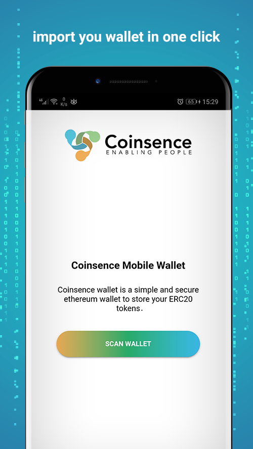

# Coinsence ERC20 mobile wallet



## Configuration

Clone the repo and open the directory:

```sh
git clone https://github.com/Coinsence/coinsence-wallet.git
cd coinsence-wallet
```

Setup API's keys inside `src/environments/environment.ts`

```sh
  export const environment = {
    apiEtherscanRinkeby: {
      url: 'https://api-rinkeby.etherscan.io/api',
      apiKey: ''
    },
    apiEthplorerMainnet: {
      url: 'https://api.ethplorer.io',
      apiKey: ''
    },
    apiBlockscoutRinkeby: {
      url: 'https://blockscout.com/eth/rinkeby/api',
      apiKey: ''
    }
  }
```

## Testing in a Browser

> **Note:** This method should only be used for development purposes. When running Coinsence wallet in a normal browser environment, browser extensions and other malicious code might have access to internal data and private keys. For production use, see the latest official [releases](https://github.com/Coinsence/coinsence-wallet/releases).

Ensure you have [Node](https://nodejs.org/) installed, then install and start Coinsence wallet:

```sh
npm install
npm run start
```

Visit [`localhost:8100`](http://localhost:8100/) to view the app.

## Testing on Real Devices

It's recommended that all final testing be done on a real device – both to assess performance and to enable features that are unavailable to the emulator (e.g. a device camera).

### Android

Follow the [Cordova Android Platform Guide](https://cordova.apache.org/docs/en/latest/guide/platforms/android/) to set up your development environment.

When your developement enviroment is ready, run the `start:android` package script.

```sh
npm run prepare:coinsence
npm run start:android
```

### iOS

Follow the [Cordova iOS Platform Guide](https://cordova.apache.org/docs/en/latest/guide/platforms/ios/) to set up your development environment.

When your developement enviroment is ready, run the `start:ios` package script.

```sh
npm run prepare:coinsence
npm run start:ios
```

## Build Coinsence App APK

The `final` commands build the production version of the app

### Android

```sh
npm install
npm run prepare:coinsence
npm run final:android
```

### iOS

```sh
npm install
npm run prepare:coinsence
npm run final:ios
```

## Build Coinsence App Bundle

### Android

```sh
npm install
npm run prepare:coinsence
npm run build:android-bundle
npm run sign:android-bundle
```

## About Coinsence Wallet

### General

## License

Coinsence Wallet is released under the MIT License. Please refer to the [LICENSE](https://github.com/Coinsence/coinsence-wallet/blob/master/LICENSE) file that accompanies this project for more information including complete terms and conditions.


